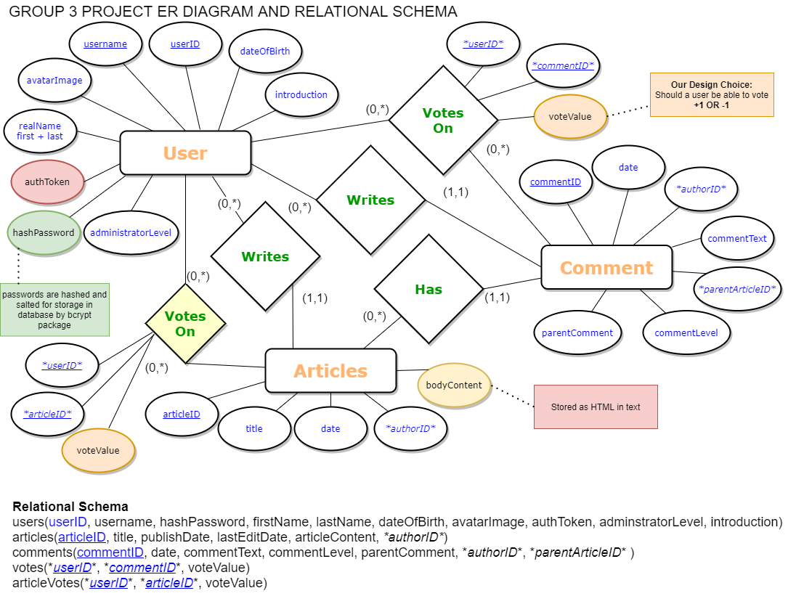

## Installation

---

Use the package manager to install modules

```
npm install
```

Create a database file called 
```[project-database.db]```
 in the same folder as 
 ```[app.js]```
Initilaise it by running the SQL found in 
```/sql/project-db-initalise-final-submission.sql```

 <br> 

## Existing User Detail

---

```
User with a single article containing several comments (made during the live demo!)
UserID: datacomDude
Password: pw123

User with article and nested comments
UserID: DoNoEvil
Password: pw123
```


 <br> 


### Project Database Design

---



